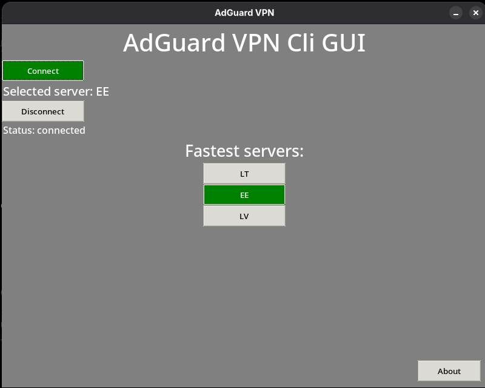

# AdGuard VPN Cli GUI

  
  Simple interface for adguardvpn-cli program. Written on Python 3.14 with Tkinter

  

## How to install and launch it
**IMPORTANT: BEFORE INSTALLING PLEASE MAKE SURE THAT YOU INSTALLED AND LOGGED IN adguardvpn-cli. ALSO YOU NEED TO INSTALL TKINTER WITH YOUR PACKET MANAGER**

**You can watch how to install adguardvpn-cli at original repository: https://github.com/AdguardTeam/AdGuardVPNCLI**

Download repo from github with site or git: 

`git clone https://github.com/pablo-chitaksa/adguardvpn-cli-gui/edit/main/README.md`

Execute main file with terminal:

`python3 main.py`

Click the 'Connect' button and enter your sudo password in terminal.

